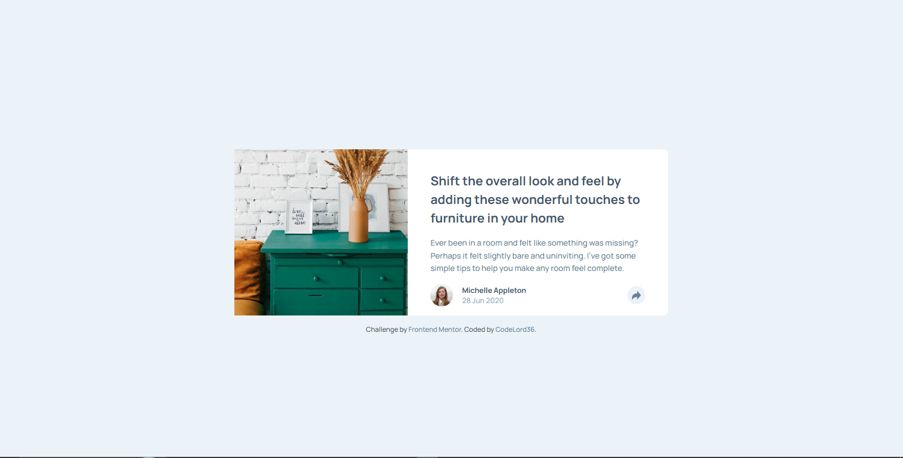
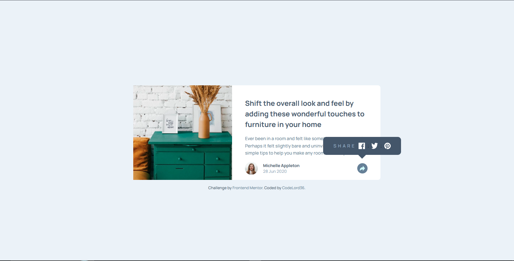
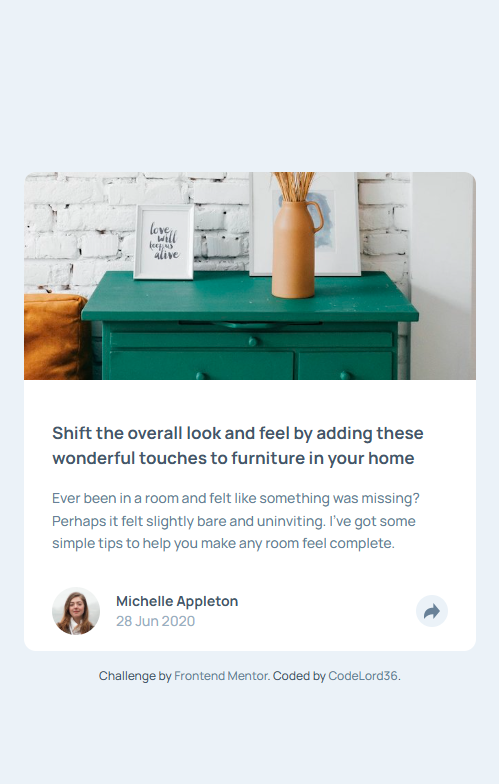
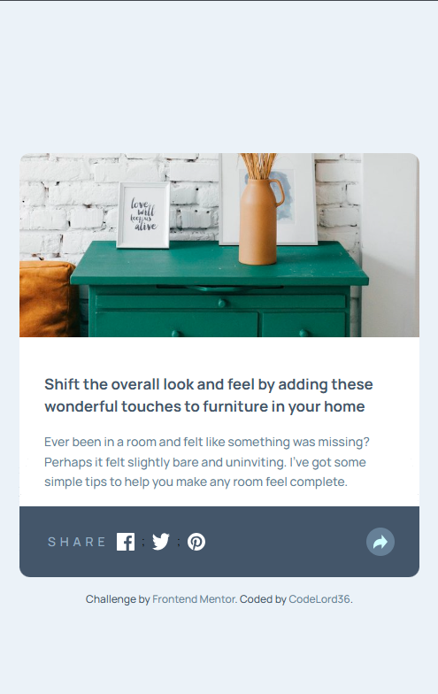

# 📰 Article Preview Component

A responsive article preview card built with **React, TypeScript, Vite, and Tailwind CSS**.

This project recreates a clean, interactive article preview card with an expandable share menu. The card displays a featured image, article title, description, author details, and a share button that reveals a popup containing social media icons.

The project focuses on **responsive frontend development, component-based architecture, interactive UI states, semantic HTML, and utility-first styling with Tailwind CSS**.

---

## 🌐 Live Demo

🚀 **[View Live Website](https://article-preview-component-nine-sooty.vercel.app/)**

The project is deployed on **Vercel** and is available online for viewing and testing.

---

## 📸 Preview

### 🖥️ Desktop — Default State



### 🖥️ Desktop — Active Share State



### 📱 Mobile — Default & Active State

<table>
  <tr>
    <td align="center">
      
      <br />
      <sub><b>Default State</b></sub>
    </td>
    <td align="center">
      
      <br />
      <sub><b>Active Share State</b></sub>
    </td>
  </tr>
</table>

---

## ✨ Features

- 📱 Responsive design for mobile and desktop screens
- 🧩 Component-based React architecture
- 🎨 Custom styling with Tailwind CSS
- 🖱️ Interactive share button with toggle state
- 💬 Share popup with Facebook, Twitter, and Pinterest icons
- 🔄 Smooth transition animations for the share menu
- 📐 Two different popup layouts (full-width bottom bar on mobile, floating tooltip on desktop)
- 🎯 Custom pointer arrow on the share tooltip
- ♿ Semantic HTML structure with accessibility labels
- 🗂️ Organized component architecture using TypeScript
- 🎭 Custom design tokens (colors, fonts, shadows) via Tailwind's `@theme` directive
- 🚀 Production deployment with Vercel

---

## 🛠️ Technologies

| Technology            | Purpose                                |
| --------------------- | -------------------------------------- |
| **React**             | Building the user interface            |
| **TypeScript**        | Static typing and safer development    |
| **Vite**              | Development server and build tooling   |
| **Tailwind CSS (v4)** | Utility-first styling and custom theme |
| **ESLint**            | Code quality and linting               |
| **Vercel**            | Production deployment                  |

---

## 🧱 Component Architecture

The application is divided into focused React components instead of placing the entire card inside one component.

```text
App
│
└── ArticlePreviewCard
    │
    └── SharePopup
```

The main card component handles the layout and state, while the `SharePopup` component handles the interactive share menu, keeping concerns separated and the code easy to maintain.

---

## 📁 Project Structure

```text
article-preview-component/
│
├── public/
│
├── src/
│   │
│   ├── assets/
│   │   ├── icons/
│   │   │   ├── icon-facebook.svg
│   │   │   ├── icon-pinterest.svg
│   │   │   ├── icon-share.svg
│   │   │   └── icon-twitter.svg
│   │   └── images/
│   │       ├── avatar-michelle.jpg
│   │       └── drawers.jpg
│   │
│   ├── components/
│   │   └── ArticlePreview/
│   │       ├── ArticlePreviewCard.tsx
│   │       ├── SharePopup.tsx
│   │       └── types.ts
│   │
│   ├── App.tsx
│   ├── index.css
│   └── main.tsx
│
├── index.html
├── eslint.config.js
├── package.json
├── package-lock.json
├── style-guide.md
├── tsconfig.json
├── tsconfig.app.json
├── tsconfig.node.json
├── vite.config.ts
└── README.md
```

The repository currently separates the main application, components, assets, and shared styling into dedicated directories.

---

## 🎨 Styling Approach

The project uses **Tailwind CSS v4** to keep styling consistent, responsive, and easy to maintain.

Shared design values are configured directly in `index.css` using Tailwind's `@theme` directive:

- **Colors** — Very Dark Grayish Blue, Desaturated Dark Blue, Grayish Blue, Light Grayish Blue
- **Typography** — Manrope font family (weights 500 and 700) with a base body size of 13px
- **Custom Shadow** — A soft, elevated shadow extracted from the design specification
- **Reset & Base Styles** — Applied using Tailwind's `@layer base`

This structure makes it easy to maintain consistent styling as the application grows.

---

## 📱 Responsive Design

The interface was designed to work across different viewport sizes, with particular attention to:

- Mobile layouts (stacked card with full-width share bar)
- Desktop layouts (side-by-side card with floating share tooltip)
- Image scaling and object positioning
- Typography scaling between breakpoints
- Content spacing and container sizing
- Responsive borders, radius, and shadow behavior
- Popup positioning and arrow direction per breakpoint

The share popup behaves differently across screen sizes: on mobile it appears as a full-width bottom bar covering the author row, while on desktop it floats as a tooltip above the share button with a downward-pointing arrow.

---

## 🚀 Getting Started

### Prerequisites

Make sure you have the following installed:

- [Node.js](https://nodejs.org/)
- npm

### 1. Clone the repository

```bash
git clone https://github.com/CodeLord36/article-preview-component.git
```

### 2. Navigate into the project

```bash
cd article-preview-component
```

### 3. Install dependencies

```bash
npm install
```

### 4. Start the development server

```bash
npm run dev
```

Vite will start the development server and provide a local URL for the application.

---

## 📦 Available Scripts

### Development

```bash
npm run dev
```

Starts the Vite development server.

### Production Build

```bash
npm run build
```

Creates an optimized production build.

### Preview Production Build

```bash
npm run preview
```

Runs the production build locally for previewing.

### Lint

```bash
npm run lint
```

Runs ESLint against the project.

These scripts are defined in the project's `package.json`.

---

## 🧠 What I Learned

Building this project helped me strengthen several frontend development concepts.

### React

I practiced managing interactive UI state with `useState` and learned how to toggle a popup menu while keeping the layout logic clean and predictable.

### TypeScript

I worked with typed interfaces for article and author data, and practiced separating types from components using a dedicated `types.ts` file.

### Tailwind CSS v4

I explored the new `@theme` directive in Tailwind v4 and learned how to define custom design tokens (colors, fonts, shadows) directly in CSS instead of a JavaScript config file.

### Responsive Design

I improved my understanding of how a single component can have two entirely different layouts depending on the viewport, using Tailwind's responsive prefixes (`md:`) to switch between mobile and desktop behaviors.

### Component Architecture

I learned that even a small interface benefits from separating concerns — the popup logic lives in its own component rather than being bloated into the main card.

### Positioning & CSS Tricks

I practiced advanced CSS positioning techniques, including using `absolute`, `bottom-full`, `-translate-x-1/2`, and the `after:` pseudo-element to create a custom tooltip arrow pointing at the share button.

### Development Workflow

I also practiced the complete frontend workflow:

```text
Design
   ↓
Component Planning
   ↓
React Development
   ↓
Tailwind Styling
   ↓
State Management
   ↓
Responsive Testing
   ↓
Linting
   ↓
Production Build
   ↓
Vercel Deployment
```

---

## 📚 Project Inspiration

This project was built as a frontend practice project based on a provided article-preview-component design specification from **Frontend Mentor**.

The focus was not only on reproducing the visual design, but also on practicing:

- React component architecture
- Interactive UI state management
- Responsive CSS with Tailwind
- TypeScript typing
- Frontend project structure
- Deployment

---

## 📌 Project Status

**Completed ✅**

The current version successfully implements the article preview card design and has been deployed to Vercel.

Future development can focus on adding more micro-interactions, animated icon transitions, and potentially expanding the component into a full article feed.

---

## 👨‍💻 Author

### CodeLord36

Frontend developer building projects with modern web technologies and continuously improving software engineering skills.

**GitHub:**
[github.com/CodeLord36](https://github.com/CodeLord36)

**Project Repository:**
[github.com/CodeLord36/article-preview-component](https://github.com/CodeLord36/article-preview-component)

**Live Demo:**
[article-preview-component-nine-sooty.vercel.app](https://article-preview-component-nine-sooty.vercel.app/)

---

## ⭐ Acknowledgements

Thanks to the frontend development community and **Frontend Mentor** for providing the design specification and inspiration for this project.

---

### Built using React, TypeScript, Vite & Tailwind CSS
